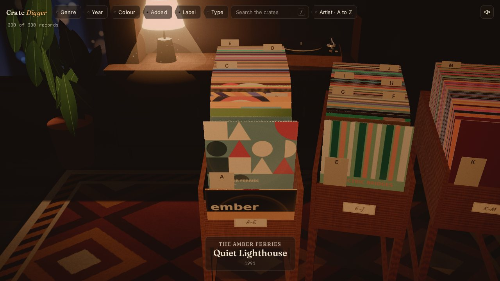
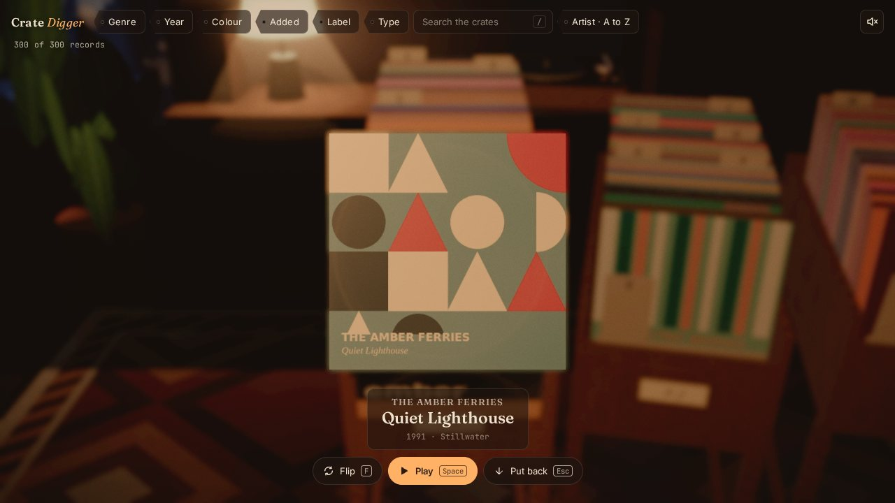
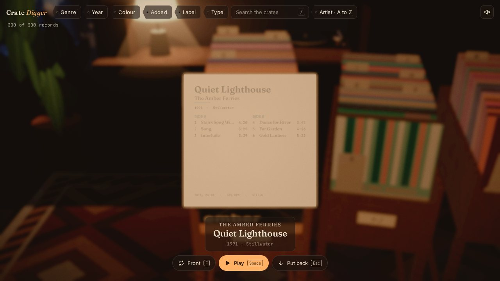
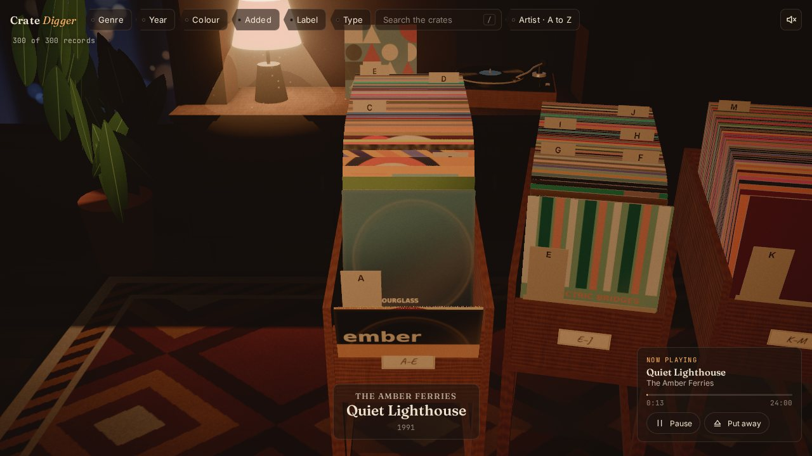
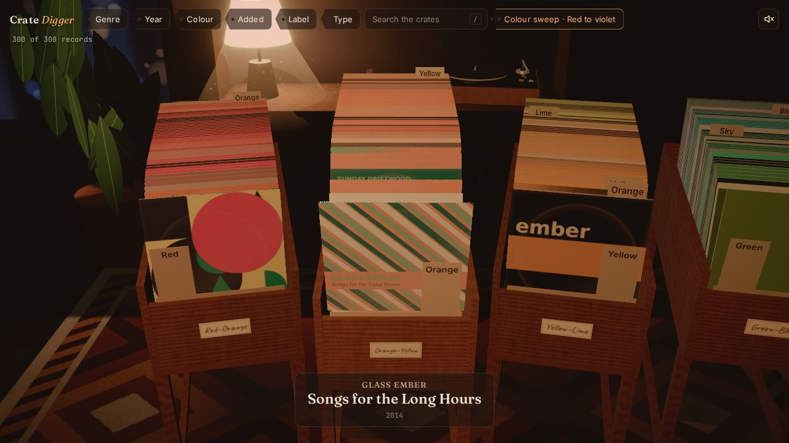
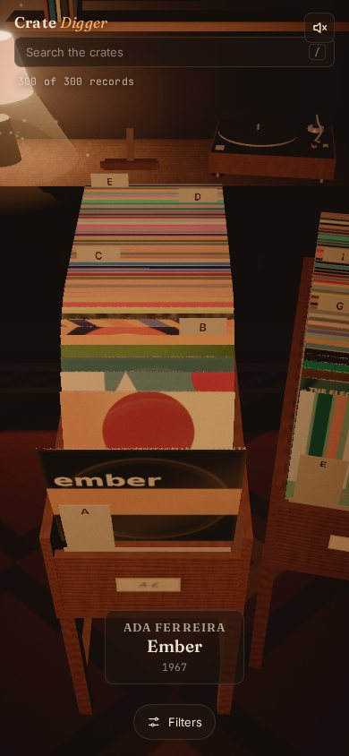
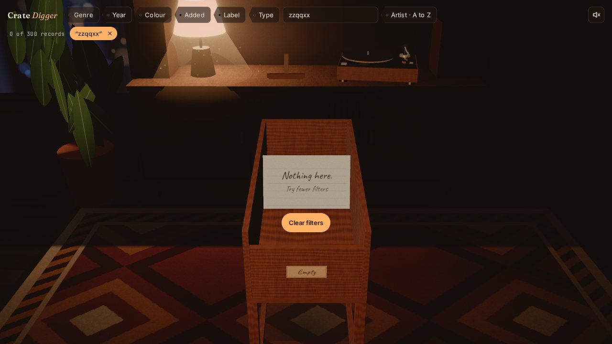

# Crate Digger

Your Spotify saved albums as a walk-in record room: LPs standing in wooden crates that you flip through by
hand, a lamp-lit sideboard, and a turntable you can drop a record onto. Beauty and smoothness first.



| Pull a record out                         | Flip it over                              | Put it on                                |
| ----------------------------------------- | ----------------------------------------- | ---------------------------------------- |
|  |  |  |

| Colour sweep sort                            | Phone portrait                             | Nothing matches                            |
| -------------------------------------------- | ------------------------------------------ | ------------------------------------------ |
|  |  |  |

_Screenshots use the generated mock library (procedural covers), rendered in software GL._

Two ways to fill the crates:

- **Connect Spotify** (in the corner): log in with your own account and the room shows exactly the albums
  saved in your library, nothing else. Put a record on the turntable and it plays in the browser tab through
  the Spotify Web Playback SDK (Premium). Login is PKCE in the browser, so the site stays plain static files.
- **A built library**: a Python ingest builds a static `library.json` plus optimised covers (or a generated
  mock library to try the room without an account). Shown when no account is connected.

The site is static files behind Caddy with basic auth. See [SPEC.md](SPEC.md) for the
full design, [docs/ARCHITECTURE.md](docs/ARCHITECTURE.md) for how it is built, and
[docs/DECISIONS.md](docs/DECISIONS.md) for interpretations, deviations and the answers to the spec's open
questions.

## Quick start (mock library, no Spotify account)

Requirements: Node 22+, Python 3.11+.

```bash
npm ci
python3 -m venv .venv && .venv/bin/pip install -r ingest/requirements-dev.txt
.venv/bin/python -m ingest.run mock --out data      # 300 albums with procedural covers, ~30 s
npm run dev                                          # http://127.0.0.1:5173
```

`data/` is gitignored and served at `/data/` by the dev server, exactly as Caddy serves the mounted volume in
production.

## Using it

|                             | Keyboard                                                 | Mouse / trackpad                           | Touch                          |
| --------------------------- | -------------------------------------------------------- | ------------------------------------------ | ------------------------------ |
| Flip through the crate      | Down/Up or S/W (Shift: 5, PageDown/PageUp: 10, Home/End) | Wheel, trackpad, vertical drag             | Vertical swipe (with momentum) |
| Switch crate                | Left/Right or A/D                                        | Click a neighbour crate, horizontal scroll | Horizontal swipe               |
| Focus a record              |                                                          | Click it                                   | Tap it                         |
| Pull the focused record out | Enter                                                    | Click it again                             | Tap it again                   |
| Flip it over                | F                                                        | Click the held record, or Flip             | Flip                           |
| Play it / pause             | Space                                                    | Play; click the tonearm to pause           | Play                           |
| Put it back                 | Esc                                                      | Click outside the record                   | Put back                       |
| Search                      | / (Esc clears, Enter focuses the best match)             |                                            |                                |
| Dev stats overlay           | `(backtick), or`?stats`                                  |                                            |                                |

Filters (genre and micro genre, release year with histogram and decade pills, cover colour, date added,
label, release type), sort modes (artist, title, year, date added, colour sweep, dig at random) and the focused
record all live in the URL, so any view is linkable and the back button works. Sound is off by default
(speaker toggle, top right).

Useful query flags: `?motion=reduced` (or `full`) overrides the OS setting, `?renderer=fallback` shows the
no-WebGL grid, `?crate=40` changes records per crate, `?tune` opens the tuning panel in a production build.

## Connect Spotify

### 1. Spotify app

Create an app at <https://developer.spotify.com/dashboard> and tick **Web API** and **Web Playback SDK**. Add
redirect URIs for every address you open the room at, exactly (scheme, host, port, path, trailing slash):

| Where                      | Redirect URI                     |
| -------------------------- | -------------------------------- |
| `npm run dev`              | `http://127.0.0.1:5173/`         |
| `npm run preview`          | `http://127.0.0.1:4173/`         |
| Your deployment            | `https://crates.example.com/`    |
| The optional Python ingest | `http://127.0.0.1:8888/callback` |

Spotify does not accept `localhost`, only the loopback IP; the dev server therefore listens on `127.0.0.1`.
No client secret exists anywhere: login is Authorization Code with PKCE. Development-mode apps need Premium
on the owner's account and allow at most five users; add yourself (and anyone else) under **User
Management**.

### 2. Configure the client id

The client id is public and is baked into the bundle at build time:

```bash
echo 'VITE_SPOTIFY_CLIENT_ID=your-client-id' > .env.local   # dev / preview (gitignored)
# Docker: SPOTIFY_CLIENT_ID=... in docker/.env, then `docker compose ... up -d --build`
```

A host can also supply it at runtime with `<meta name="spotify-client-id" content="...">` in `index.html`.
Without a client id the Connect button explains what is missing.

### 3. Use it

**Connect Spotify** (top right, or the welcome panel when there is no library on disk) goes to Spotify's
login, then back to the view you left. The first load reads every saved album (50 per request) and samples
each cover's colours in the browser, with progress on the splash; later visits show the cached copy at once
and check in the background whether you saved or removed anything. Genres arrive a moment later (one request
per artist, cached for 30 days) and file records under the same dividers as the ingest
(`ingest/genre-map.json`).

Playing a record starts the album in this tab (a Spotify Connect device called "Crate Digger"). Pausing in the
room pauses Spotify, and pausing from your phone or keyboard media keys lifts the tonearm in the room. Without
Premium, or in a browser without DRM support, the turntable keeps time silently and offers **Open in
Spotify**. The account menu (your name, top right) has **Disconnect**, which forgets the login and everything
cached from the account on this device.

What changed in Spotify's API in 2026 and how this copes is in [docs/DECISIONS.md](docs/DECISIONS.md).

## A built library (ingest)

Optional: for a library on disk instead of a live connection (also works without Premium, and adds
MusicBrainz labels, which the API no longer returns). It needs the `http://127.0.0.1:8888/callback` redirect
URI on the same Spotify app.

### 1. Spotify app limits

What changed in 2026 and how the ingest copes (details in [docs/DECISIONS.md](docs/DECISIONS.md)):

`label` is no longer returned, so labels come from optional MusicBrainz enrichment; the batch artist endpoint
is gone, so genres are fetched one artist at a time and cached for 90 days.

### 2. Ingest

```bash
export SPOTIFY_CLIENT_ID=your-client-id
.venv/bin/python -m ingest.run spotify --enrich        # first run: opens the Spotify login in a browser
.venv/bin/python -m ingest.run spotify                 # later runs: incremental, a handful of requests
```

| Option            | Effect                                                                                           |
| ----------------- | ------------------------------------------------------------------------------------------------ |
| `--full`          | Rescan everything and prune albums you un-saved (`--refresh` also re-fetches metadata)           |
| `--enrich`        | Fill missing labels and genres from MusicBrainz (1 request/s, cached)                            |
| `--liked-tracks`  | Also derive albums from Liked Songs (`--liked-threshold 3`: 3+ liked tracks, or the whole album) |
| `--no-browser`    | Headless login (on a VPS): open the printed URL anywhere, paste the redirected URL back          |
| `--ktx2`          | Also write KTX2 covers (needs `toktx` from KTX-Software)                                         |
| `--crate-size 40` | Records per crate in the viewer (stored in library.json)                                         |

Other commands: `export --file YourLibrary.json` builds a library from Spotify's account data download
(metadata from MusicBrainz, or `--spotify` for per-album lookups), `remap` re-applies an edited
`ingest/genre-map.json` with no network calls, `validate` checks `library.json` against the schema.

`library.json` is written atomically (temp file, then rename), so a running site never sees a half-written
file. Past 1 MB gzipped, track lists move into `data/tracks/<id>.json` and load when a record is held.

## Deploy (Docker on a VPS)

```bash
cp docker/.env.example docker/.env          # set SITE_ADDRESS, BASIC_AUTH_USER, BASIC_AUTH_HASH
docker run --rm caddy:2-alpine caddy hash-password --plaintext 'a long passphrase'   # -> BASIC_AUTH_HASH
docker compose -f docker/compose.yml up -d --build
```

- Caddy serves the static bundle with automatic HTTPS, basic auth on every path, `noindex` headers, a strict
  CSP, long-lived caching for content-hashed assets and revalidation for `library.json`.
- `data/` on the host is mounted read-only; re-running the ingest updates the site without a rebuild.
- Ingest in a container (first run is interactive for the login; the refresh token is kept in a volume):

  ```bash
  docker compose -f docker/compose.yml --profile ingest run --rm ingest spotify --out /work/data --no-browser
  # nightly, from the host's crontab:
  15 4 * * * cd /srv/crate-digger && docker compose -f docker/compose.yml --profile ingest run --rm -T ingest spotify --out /work/data
  ```

- Prefer a private network? Set `SITE_ADDRESS=:80` and reach it over Tailscale or WireGuard instead of the
  public internet.

## Development

| Command                                           | What it does                                                                           |
| ------------------------------------------------- | -------------------------------------------------------------------------------------- |
| `npm run dev`                                     | Vite dev server with the tuning panel (lil-gui)                                        |
| `npm run build` / `npm run preview`               | Type-check and build; serve the build on :4173                                         |
| `npm test`                                        | Unit tests (Vitest)                                                                    |
| `npm run e2e`                                     | Playwright: smoke, accessibility (axe), fallback, context loss (`npm run build` first) |
| `PERF=1 PERF_STRICT=1 npm run e2e:perf`           | 30 s scroll test; fails if p95 frame time > 16.6 ms (run on real hardware)             |
| `npm run size`                                    | Initial JS budget check (350 KB gzipped)                                               |
| `npm run lint`, `npm run format`                  | ESLint, Prettier                                                                       |
| `npm run check`                                   | Everything CI runs for the viewer                                                      |
| `.venv/bin/pytest`, `.venv/bin/ruff check ingest` | Ingest tests and lint                                                                  |

Every feel parameter (fan spacing, lift, leans, sink, riser, springs, camera, light, post) lives in
`src/scene/tuning.ts` and is live-editable in the dev tuning panel; "Copy values as JSON" exports a tuned set.

## Budgets and how they are checked

| Metric             | Target                           | Status in v1                                                     |
| ------------------ | -------------------------------- | ---------------------------------------------------------------- |
| Frame time p95     | 16.6 ms at 1080p, integrated GPU | Measured by `e2e:perf`; enforce with `PERF_STRICT=1` on hardware |
| Draw calls         | ≤ 250                            | ~150 in a full room (asserted in e2e)                            |
| Triangles          | ≤ 300,000                        | ~6,000 (asserted)                                                |
| Texture memory     | ≤ 256 MB desktop, 128 MB mobile  | Cover LRU: ≤ 168 MB desktop, ≤ 21 MB mobile (asserted)           |
| Initial JavaScript | ≤ 350 KB gzipped                 | ~270 KB including three.js (`npm run size`, in CI)               |
| `library.json`     | < 1 MB gzipped for 1,000 albums  | 300 mock albums: ~70 KB; auto-split past 1 MB                    |

Rendering adapts at runtime: pixel ratio capped at 2 (1.5 on mobile), stepped down by 0.25 when the p95 frame
time stays above 18 ms for a second and back up after 5 s of stable frames; the loop drops to a 15 fps idle
tick when nothing moves; WebGL context loss is handled by rebuilding GPU resources.

## Project layout

```text
ingest/        spotify.py, enrich.py, export.py, covers.py, palette.py, genres.py, mock.py, run.py, tests/
data/          library.json, covers/                 (gitignored)
src/
  data/        library, filters, sort, crates, search, layout, url, colour (pure, no three.js)
  motion/      spring, easing, tween, focus, choreography
  scene/       sceneApp, room, bake, crate, records, dividers, hold, deck, turntable, vinyl, camera,
               materials, post, dust, textureCache, input, stats, tuning, devtools
  spotify/     auth (PKCE), api, library (saved albums -> library), mapping, palette, genres, session
  playback/    adapter, simulated, spotify (Web Playback SDK)
  audio/       sounds
  state/       store, commands, urlSync
  ui/          App, FilterBar, FilterControls, Popover, Stage, A11yList, FallbackGrid, keyboard, styles
  main.ts
docker/        Dockerfile, Dockerfile.ingest, compose.yml, Caddyfile, .env.example
tests/         unit/ (Vitest), e2e/ (Playwright)
docs/          ARCHITECTURE.md, DECISIONS.md, screenshots/
```

## Status against the spec's milestones

| Milestone                   | State                                                                                        |
| --------------------------- | -------------------------------------------------------------------------------------------- |
| M0 Foundation and mock data | Done                                                                                         |
| M1 Room and crates          | Done (procedural room, baked-look lighting, post, parallax, drift)                           |
| M2 Browsing feel            | Done; tune the feel on your own hardware with the tuning panel                               |
| M3 Filters, sort, search    | Done, except KTX2 texture loading in the viewer (ingest can produce KTX2; see DECISIONS #17) |
| M4 Turntable                | Done: real playback via the Web Playback SDK, simulated clock as fallback                    |
| M5 Real data and deploy     | Ingest, Docker and Caddy done and tested; the Spotify run itself needs your account          |
| M6 Polish and accessibility | Done: listbox, reduced motion, phone layouts, fallback grid, adaptive resolution, perf test  |

Next steps: wire `KTX2Loader` for compressed covers, and a hand-modelled room glTF behind `buildRoom()`.

## Privacy

The deployed site holds a personal library: basic auth on every path, `noindex` in both headers and markup,
`robots.txt` disallowing everything, and `data/` kept out of git. The ingest's token cache lives in
`ingest/.cache/` (gitignored, owner-only permissions). A connected browser keeps its Spotify token and the
cached library in `localStorage` for this site only; the strict CSP limits scripts to this site and Spotify's
SDK, and Disconnect deletes all of it. The browser talks only to Spotify (API, login, cover CDN, SDK).

Fonts, sounds and textures: see [CREDITS.md](CREDITS.md).
